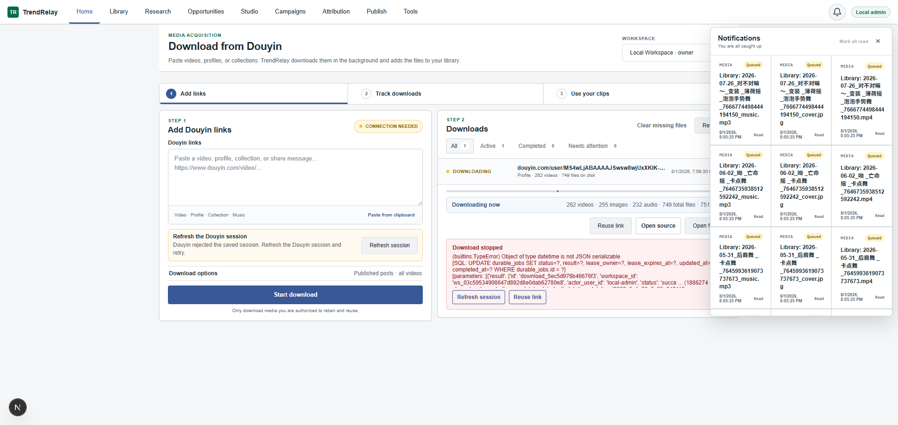
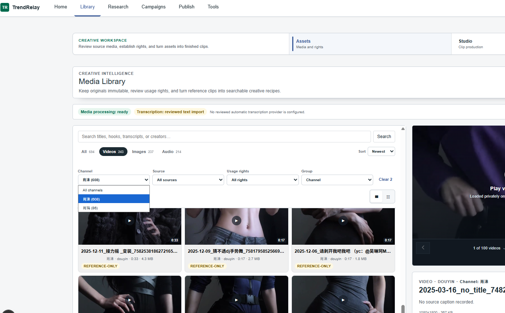

# TrendRelay

**Download authorized Douyin media, track large batches, and review every clip in a searchable local library.**

TrendRelay is a local-first Windows workspace for collecting reference media from Douyin. Paste a video, profile, collection, music, or copied share link; TrendRelay downloads it in the background, preserves the original source, and adds the resulting videos, images, and audio to your Library.



## What works today

- **Paste and download** Douyin videos, profiles, collections, music pages, and copied share messages.
- **Download full profiles** with **all videos** selected by default, or set a smaller limit when needed.
- **Track large batches** with live video, image, audio, file-count, and disk-size progress.
- **Resume interrupted work** after session expiry, provider errors, or an application restart.
- **Keep source provenance** so every Library item can lead back to the Douyin URL that produced it.
- **Avoid duplicate work** through local metadata, file checks, and incremental downloading.
- **Review media locally** using thumbnails, filters, gallery/list views, and an in-page video player.
- **Keep downloads private** in the local `.data/` directory, which is excluded from Git.

## From link to Library

1. Open **Home** and paste one or more Douyin links or share messages.
2. Choose the download options. Profiles default to **Published posts / all videos**.
3. Start the batch and follow the live counts under **Downloads**.
4. Refresh the Douyin session and resume the same link if Douyin interrupts a long run.
5. Open **Library** to search, filter, preview, and revisit the original source.



Library videos use poster thumbnails and load the video stream only after you choose to play it. This keeps browsing fast and avoids triggering external download managers while changing filters or moving between items. Use the previous/next controls or arrow keys to navigate; press Space to play or pause.

## Quick start on Windows

### Requirements

- [Git](https://git-scm.com/downloads)
- [Node.js 22 or newer](https://nodejs.org/)
- [Python 3.12 or newer](https://www.python.org/downloads/)

### Install and run

```powershell
git clone https://github.com/meap158/TrendRelay.git
cd TrendRelay
.\start.cmd
```

The first run installs the application dependencies, creates the Python environment, applies database migrations, starts the local services with hot reload, and opens TrendRelay in your browser. Setup prints four numbered stages and keeps reporting progress during longer Python downloads; it stops with a useful network error instead of waiting indefinitely.

If the browser does not open automatically, visit [http://127.0.0.1:3001](http://127.0.0.1:3001).

If setup is interrupted, run `.\start.cmd` again. Completed work is reused. To verify an existing Python environment without downloading anything, run:

```powershell
.\.venv\Scripts\python.exe scripts\bootstrap.py --check
```

### Connect Douyin

Use **Refresh session** on Home and complete the Douyin login in the opened browser. The equivalent command is:

```powershell
npm run douyin -- connect
```

The session is stored locally under `.data/douyin/`. Refresh it only when Douyin rejects a download or the saved session expires.

## Download behavior

TrendRelay stores downloaded files under `.data/downloads/douyin/` and automatically registers them in the media Library. Library refresh reconciles items removed from disk. Use **Clear missing files** on Home to remove download records whose files are gone; records that still reference on-disk media are kept.

For command-line batch downloads:

```powershell
npm run douyin -- batch "https://www.douyin.com/user/..." --limit 0
```

`--limit 0` means all available items. The Home interface selects this behavior by default for profile downloads.

## Local-first by design

- Downloads, cookies, databases, thumbnails, proxies, and job state stay in `.data/`.
- Provider source and isolated runtimes stay in `.tools/`.
- Both directories, along with `.env`, are excluded by `.gitignore`.
- Original media is kept immutable; generated previews and derivatives are stored separately.
- Acquired media defaults to **reference only** until reuse rights are reviewed.

Never commit real cookies, access tokens, downloaded media, customer data, or generated databases.

## Project status

TrendRelay is an early, Douyin-first release. The downloader, durable background jobs, provenance capture, and local media Library are the current core product.

Research integrations, Meta Ads collection, opportunity scoring, Studio production, campaigns, publishing, and attribution remain under active development. They are included in the repository for contributors and testing, but they are not yet the primary supported workflow.

## Development

Run the web and API development environment:

```powershell
npm ci
python -m venv .venv
.\.venv\Scripts\python.exe scripts\bootstrap.py
.\.venv\Scripts\python.exe scripts\db.py upgrade
npm run dev
```

Validate changes with:

```powershell
npm run release:check
```

The main code lives in:

```text
apps/web       Next.js interface
services/api   FastAPI control plane and media catalog
scripts        Development supervisor and Douyin integration
workers        Background media and publishing workers
```

See [DESIGN.md](DESIGN.md) for interaction principles, [CONTRIBUTING.md](CONTRIBUTING.md) for contribution guidance, and [SECURITY.md](SECURITY.md) for private vulnerability reporting.

## Responsible use

Only download, retain, and reuse media you are authorized to access. Douyin integrations may rely on browser-facing or reverse-engineered interfaces that can change without notice and may be restricted by platform terms. Review the [third-party notices](docs/third-party/README.md) before redistribution.

No project-level software license has been selected yet. Until one is added, TrendRelay-authored code remains under default copyright while incorporated dependencies retain their respective licenses.
