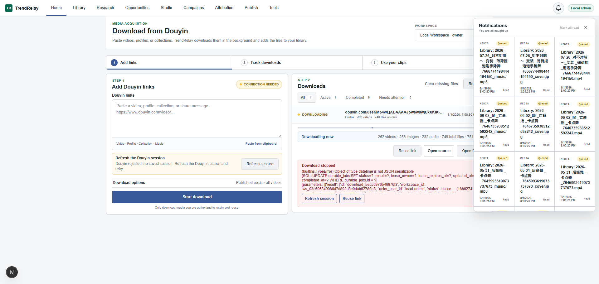
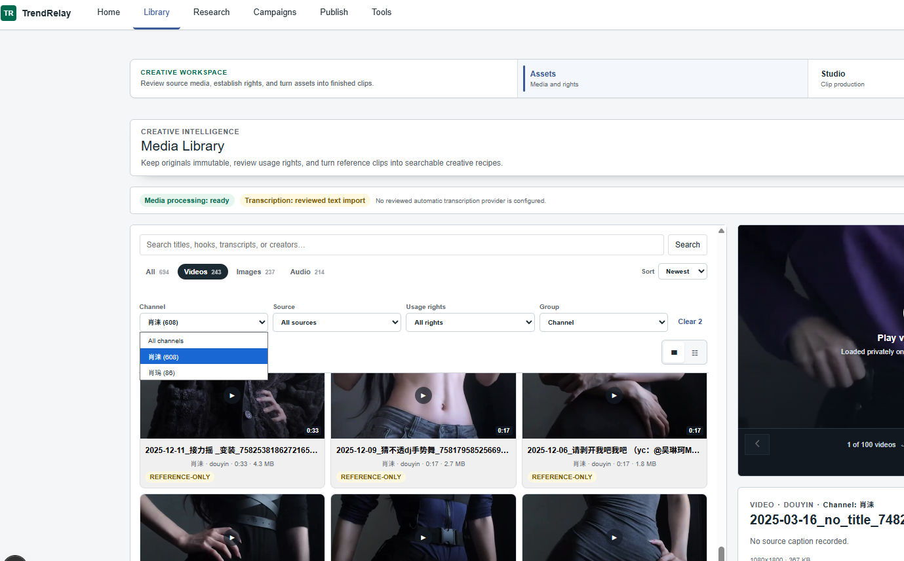

# TrendRelay

**Find what is trending, collect authorized Douyin media, prepare every clip locally, and run campaigns that post where an affiliate link can actually be clicked.**

TrendRelay is a local-first Windows workspace. Discover consolidates topics, posts, ads, and news; **Download** pastes Douyin links and batches them in the background; **Library** keeps the original files immutable and the edits beside them; **Campaigns** feeds connected accounts from a queue on a cadence; **Publish** talks to hosted engines; **Attribution** holds the products and the networks' own affiliate URLs.



## What works today

- **Discover** topics, hot posts, public ads, first-party signals, and news by country. Every usable finding can **Add to campaign**; Douyin terms can also **Save to Library** because they can acquire real media.
- **Paste and download** Douyin videos, profiles, collections, music pages, and copied share messages.
- **Download full profiles** with **all videos** selected by default, or 10 / 20 / 50 / 100 per source.
- **Track large batches** with live video, image, audio, file-count, and disk-size progress.
- **Resume interrupted work** after session expiry, provider errors, or an application restart.
- **Keep source provenance** so every Library item can lead back to the Douyin URL that produced it.
- **Avoid duplicate work** through local metadata, file checks, and incremental downloading.
- **Review media locally** using thumbnails, filters, gallery/list views, an in-page player, and **Import media** (drag-and-drop upload, file/folder picker, or local path batch import).
- **Transcribe and translate locally** with faster-whisper speech drafts and Argos caption language packs; speech and on-screen text (OCR) are automatically queued upon media ingestion when providers are ready, with detected text applied by default.
- **Generate governed voiceovers** from reviewed transcripts (or optionally machine drafts) with optional ElevenLabs setup, live free/paid allowance, regional voice search, current models, and per-take voice controls before a metered job is queued.
- **Apply non-destructive effects and clip ranges** to one item or a campaign-sized selection while keeping every original immutable; effects like Cover On-screen Text automatically resolve bounding regions per asset in batch.
- **Run a campaign** from one workspace: queue clips and picture carousels, write copy, assign connected accounts, attach an imported offer, set posting times, preview the next day, and switch Autopilot on.
- **Manage every campaign together** from Campaigns → Campaign overview: compare provider-backed output, views, engagement, queue health, warnings, and pending approvals, with compact metric charts, without opening each campaign.
- **Place each affiliate URL where it can be clicked** — in the caption on networks that support it, and as a profile/bio pointer on Instagram and TikTok. Disclosure always leads the caption.
- **Publish a one-off** from Publish with media, copy, disclosure, affiliate placement, and schedule restored together when the post came from a campaign.
- **Manage products in Attribution** as one table of offers, handmade tracking links, imported conversions, and commission context.
- **Let an assistant draft, not send** over MCP: fill missing captions, bring an image into the Library, and propose a campaign post that stays a draft until a person promotes it in the app.
- **Set providers up on Tools** — Douyin session, media-AI runtimes, ElevenLabs, research sources, and Assistant Access — without leaving the workspace.
- **Keep downloads private** in the local `.data/` directory, which is excluded from Git.

The interface is available in English, Tiếng Việt, 日本語, Français, 中文, Русский, and العربية.

## Discover

1. Open **Discover** and pick a country. The shared command bar chooses Trends, Ads, Hashtags, and Videos; the workspace views are Overview, Topics, Hot posts, Ads & signals, and Opportunities.
2. Read a board. News ranks stories by how many outlets carry them; research and public ad sources stay on their own boards rather than inventing one cross-platform rank.
3. Choose **Add to campaign** to create or extend a draft with the source URL and evidence attached. Adding evidence never implies media rights and never downloads a third party's asset.
4. On a Douyin term, use **Save to Library** / download-per-topic when you are authorized to collect the clips themselves. Watch that work under **Download**.

Provider-heavy boards mount only when their view is open. Optional keys (YouTube Data API, Last 30 Days research providers, Meta Ads) are configured from **Tools**; missing keys show as unconfigured, not as empty results.

## From link to Library

1. Open **Download** (the TrendRelay mark) and paste one or more Douyin links or share messages.
2. Choose the download options. Profiles default to **Published posts / all videos**.
3. Start the batch and follow the live counts. Completed batches link through to Library, campaign planning, and Publish.
4. Use **Connect Douyin** the first time, and **Refresh session** if Douyin interrupts a long run, then resume the same link.
5. Open **Library** to search, filter, preview, import local media (single or batch), and revisit the original source.



Library videos use poster thumbnails and load the video stream only after you choose to play it. This keeps browsing fast and avoids triggering external download managers while changing filters or moving between items. Use the previous/next controls or arrow keys to navigate; press Space to play or pause.

Open the transcription status control in Library to set up or switch on local speech transcription and caption translation. Provider downloads run as recoverable background jobs, and completed runtimes are reused after a restart. A stale Hugging Face login is not required for the public faster-whisper model. Automatic transcripts are saved as machine drafts so they can be checked before they become reviewed text; translated caption tracks preserve the original transcript. Speech inference automatically detects Windows CUDA runtime DLLs (cuBLAS/cuDNN) for GPU `float16` execution with graceful CPU fallback, and setting the provider up on a machine with an NVIDIA GPU downloads the cuBLAS wheel CTranslate2 links against but does not ship. Video effects (face blur, face overlays, subtitles) stream directly into FFmpeg `h264_nvenc` hardware GPU encoding, eliminating OpenCV CPU video-writing overhead and intermediate re-encoding passes. Preparing the on-screen text provider on Windows installs the DirectML build of ONNX Runtime and asks RapidOCR for the GPU only where a DX12 adapter actually reports itself, which measured 1233ms to 484ms a frame on an RTX 2060 for identical text; face identity picks the same runtime fastest-first (CUDA, then DirectML, then CPU) and is carried along by it. The three ONNX Runtime builds publish one module, so this is a substitution, and the replaced build's record is retired only once the new one has landed - a worker still holding the module locks its files, so stop the workers if the download reports a permission error. Explicit `MEDIA_AI_DEVICE`, `MEDIA_AI_COMPUTE_TYPE`, `MEDIA_AI_CPU_THREADS`, and `MEDIA_AI_SPEECH_BATCH_SIZE` settings remain available for diagnostics and controlled deployments.

A selected clip can go to **effects**, **transcribe**, **captions**, or **voiceover** in one toolbar; notification links open that exact item, or a temporary Library view of a whole batch.

## Quick start on Windows

### Requirements

- [Git](https://git-scm.com/downloads)
- [Node.js 22 or newer](https://nodejs.org/)
- [Python 3.12 or newer](https://www.python.org/downloads/)

### Install and run

```powershell
git clone https://github.com/meap158/TrendRelay.git
cd TrendRelay
.\start.cmd
```

The first run installs and verifies the application dependencies, creates the Python environment, applies database migrations, starts the local services with hot reload, and opens TrendRelay in your browser. In development, the runner prepares the remaining primary tabs in the background after the browser opens so the first switch to each tab does not wait for a route compilation. Setup prints four numbered stages and keeps reporting progress during longer downloads; it stops with a useful network error instead of waiting indefinitely. TrendRelay's lockfile and CI are validated with npm 11.16, and a version-pinned install-script allowlist covers its reviewed Electron, media, compiler, and resolver runtimes. If an install is interrupted or incomplete, running `start.cmd` again detects and repairs it automatically.

Social publishing runs entirely against a hosted API. Pick Bundle.social, Zernio, Buffer or WoopSocial on **Publish**, paste that engine's API key into the form, and TrendRelay writes it back to the local `.env`. Several can be switched on at once, and one post addresses destinations across all of them. No local publishing service is installed or supervised.

Buffer has no upload endpoint, so it needs media already hosted at a public URL (Cloudflare R2 is configured on the same screen). The other three accept the approved local file directly. WoopSocial uploads are refused above 100 MB rather than failing at the engine.

Campaigns read engagement back from the engine that published, which is a requirement of supporting an engine rather than an extra: Bundle.social, Zernio and Buffer all report views, likes, comments, shares and saves. WoopSocial does not, because its API has no analytics at all — it reports whether a post was delivered, not how it did — and it says so in its own definition rather than reading zero and looking measured. A figure that cannot be read is left blank and asked for again later; it is never recorded as nought. See [ADR 0011](docs/architecture/0011-governed-social-publishing.md).

If the browser does not open automatically, visit [http://127.0.0.1:3001](http://127.0.0.1:3001).

### Running it as an app rather than a dev server

By default the web front end is Next.js in development mode: it compiles each
page the first time you open it and reloads the browser when a file changes.
That is what you want while editing the code and is the slower, heavier way to
use TrendRelay day to day.

To serve a compiled build instead:

```powershell
.\start.cmd --production
```

It compiles once, then serves what it compiled — pages open without a wait,
memory stays flat, and there is no bundler watching the tree. The trade is
exactly that last part: **code changes do not appear until the next launch**,
which rebuilds automatically when it sees a source file newer than the last
build. Hot reloading and a production server are alternatives rather than
settings, because Fast Refresh *is* the development bundler watching your
files; a production server has none resident to do it.

Use the default while working on TrendRelay, and `--production` when using it.

To open the same local services in an Electron window:

```powershell
.\start.cmd --desktop
```

`start-electron.bat` is the same flag. `update.cmd` fast-forwards the current branch only when the worktree is clean and an upstream is set.

If setup is interrupted, run `.\start.cmd` again. Completed work is reused. To verify an existing Python environment without downloading anything, run:

```powershell
.\.venv\Scripts\python.exe scripts\bootstrap.py --check
```

### Connect Douyin

Use **Connect Douyin** on Download (owner only) and complete the Douyin login in the opened browser. **Refresh session** repeats that capture when the saved cookies expire. The equivalent command is:

```powershell
npm run douyin -- connect
```

The session is stored locally under `.data/douyin/`. Chromium is used only for that login; it is never used to download media. Refresh only when Douyin rejects a download or the saved session expires.

### Import Shopee Product Offers

Open **Attribution**, choose **Add products**, and use **Shopee CSV export**:

1. Select **Open Shopee Product Offer**. Only this explicit action opens the real Shopee Affiliate page in your normal browser; background checks never open a window.
2. Sign in directly with Shopee, select up to 100 products, and export the CSV file from **Hoa hồng Sản phẩm / Product Offer**.
3. Choose that `.csv` in TrendRelay. Review the readable, new, existing, duplicate, and invalid-row counts, then import.

This supported path does not give TrendRelay a Shopee cookie and does not depend on automated browsing or passing a CAPTCHA. CSV files are decoded as UTF-8 (with or without a BOM), limited to 5 MB and 100 products, and validated before import. Shopee's CSV has no image URL, so Shopee rows do not show or reserve an empty thumbnail. Its `Link ưu đãi` column already contains the commission-bearing affiliate URL; campaign posts carry that exact URL. First-party `/c/` tracking links remain available as a separate, explicit Attribution action when you mint them yourself. Existing `.xlsx` exports remain accepted as a compatibility fallback. For a small batch, the same dialog also accepts up to 100 HTTPS Shopee product links.

## From Library to a running campaign

1. Open **Campaigns**. The list defaults to **Current** (draft and active); archived campaigns stay off the daily rail until you choose Archived or All.
2. Create or select a campaign. Readiness sits beside **Queue & setup** and **Schedule**.
3. Choose **Add from library**. A video is one post; pictures chosen together are one carousel. Copy can wait — items without copy are marked as needing it rather than posted blank.
4. Optionally apply Library effects first so the queue holds the approved cut, not only the original.
5. Write shared or per-item copy and hashtags. Leave the disclosure and the affiliate URL out of the body; Autopilot composes those per network when it posts.
6. Add connected accounts from Publish (Threads, Facebook, Instagram, TikTok, and the rest of an engine's destinations when they are connected). Choose an imported Attribution offer, or post with no link.
7. Open **Schedule**, keep or add workspace posting times, and preview the next day. Nothing in that preview is created.
8. Switch Autopilot on. **Fill drafts for review** is the safest first live run; scheduling publishes at the posting time without asking again.
9. Follow the **Timeline** for what already went out and what is next. Promote a draft into the rotation, or hold it, in the same panel.

Campaigns does not ask operators to retype data that already exists elsewhere. Destinations are exact available accounts from Publish, posting times are the workspace schedule, affiliate choices are imported Attribution offers, and media comes from Library. A video is a post; pictures chosen together are a carousel.

A URL in an Instagram or TikTok caption is not a link. TrendRelay therefore puts those offers on the profile and points the caption at it, instead of publishing a dead URL. On networks where a caption link is clickable, the same offer URL goes in the caption. Disclosure always leads, because each post is its own advertisement.

For a one-off governed post, open **Publish**, pick the clip, the exact connected account, the posting time, and — when relevant — the imported offer. Opening a campaign post there restores the destination together with its clip, copy, disclosure, affiliate placement, and schedule.

## Assistant access (MCP)

**Tools → Assistant Access (MCP)** starts a loopback server for one workspace. An optional OpenAI tunnel dials outward; nothing binds a public address.

An assistant may read campaign context, write draft copy, change posting times, upload an image into the Library, and propose a campaign post. That post arrives as a **draft outside the rotation**. An assistant may not sign in, connect an account, approve, publish, or deploy. Reviewed procedures live under `SOP/` and are selected by action (`list_sops` / `get_sop`); reading an SOP does not grant extra authority.

Product-aware MCP reads are also available: `list_products` and
`list_campaign_products` page compact catalog rows with product ids, images,
listing previews, and offers; `get_product_details` retrieves one complete
stored listing plus campaign links and attribution; `get_product_attribution`
returns the performance-only view. Long descriptions and galleries are fetched
by id so an assistant can use them as media-prompt context without loading the
whole catalog at once.

## Download behavior

TrendRelay stores downloaded files under `.data/downloads/douyin/` and automatically registers them in the media Library. Library refresh reconciles items removed from disk. Use **Clear missing files** on Download to remove download records whose files are gone; records that still reference on-disk media are kept.

For command-line batch downloads:

```powershell
npm run douyin -- batch "https://www.douyin.com/user/..." --limit 0
```

`--limit 0` means all available items. The Download interface selects this behavior by default for profile downloads.

## Local-first by design

- Downloads, cookies, databases, thumbnails, proxies, and job state stay in `.data/`.
- Provider source and isolated runtimes stay in `.tools/`.
- Both directories, along with `.env`, are excluded by `.gitignore`.
- Original media is kept immutable; generated previews and derivatives are stored separately.
- Acquired media defaults to **reference only** until reuse rights are reviewed.

Never commit real cookies, access tokens, downloaded media, customer data, or generated databases.

## Project status

TrendRelay is an active local-first product. Douyin acquisition, Discover boards, durable jobs, the media Library and effects, campaign Autopilot, multi-engine publishing, Shopee CSV offer import, Attribution, and MCP assistant access are connected and covered by automated checks. External publishing still depends on the operator connecting at least one supported engine and following that engine's account and quota requirements. Optional research and ads providers need their own keys; MediaCrawler stays catalogued and off.

## Tech stack

- **Web interface:** Next.js 16, React 19, TypeScript, and accessible local UI primitives.
- **API and workers:** Python 3.12+, FastAPI, SQLAlchemy, Alembic, and durable local job workers. Independent effect, caption, and transcription batches use a bounded adaptive native-work lane (1–4 workers from available CPU, overrideable with `TRENDRELAY_MEDIA_WORKERS`); voiceover generation uses a conservative two-request paid-provider lane. Individual jobs remain leased, cancellable, and independently retryable.
- **Media:** FFmpeg/ffprobe plus isolated Python integrations for downloading, inspection, and non-destructive effects. H.264 renders probe NVENC, Quick Sync, AMF, and VideoToolbox once per worker, use the first encoder that actually completes a frame, and retry transparently with libx264 if a hardware session fails. Set `TRENDRELAY_VIDEO_ENCODER=software` only when hardware encoding must be disabled for diagnostics.
- **Assistant:** optional MCP extra (`pip install -e services/api[mcp]`), Streamable HTTP on loopback, policy defaulting to refusal.
- **Desktop:** Electron as an optional native window over the same local services.
- **Storage:** local SQLite and `.data/` media by default; optional public object storage only for publishing engines that fetch media by URL.
- **Quality:** Pytest, Node's test runner, TypeScript, ESLint, Ruff, and production Next.js builds.

## Interface conventions

- Primary workspaces use the same compact top navigation, page heading, status language, and action hierarchy. The active workspace, language, and timezone live in one persistent top-right context control; switching it updates every workspace-scoped screen and the global job feed.
- Notification links preserve the scope of the work they report: one-media jobs open that exact Library item, while grouped and batch jobs open a removable temporary Library view containing the affected media only. That view keeps the originating action name and live completion/retry progress visible in one compact row.
- Familiar actions use the shared Lucide icon vocabulary; icons supplement readable labels and icon-only controls retain accessible names and tooltips.
- Dense operational screens favor short toolbars, compact cards, sticky context only where it helps, and responsive icon-first navigation on narrow screens.
- Table search, selection counts, and bulk actions share a stable toolbar slot; changing selection state must not insert controls that shift the rows below.
- Every single-value dropdown uses the shared `Select` / `SearchSelect` control. Native browser controls remain the value and validation source; custom styling follows [DESIGN.md](DESIGN.md) rather than replacing predictable behavior for decoration alone.

## Development

Run the web and API development environment:

```powershell
npm ci
python -m venv .venv
.\.venv\Scripts\python.exe scripts\bootstrap.py
.\.venv\Scripts\python.exe scripts\db.py upgrade
npm run dev
```

Validate changes with:

```powershell
npm run release:check
```

The main code lives in:

```text
apps/web       Next.js interface
services/api   FastAPI control plane and media catalog
scripts        Development supervisor, Douyin, MCP, and tunnel
workers        Background media and publishing workers
SOP            Canonical MCP guide and action procedures
config         Pinned tool catalog
```

See [DESIGN.md](DESIGN.md) for interaction principles, [CONTRIBUTING.md](CONTRIBUTING.md) for contribution guidance, [docs/TUNNEL_AND_MCP.md](docs/TUNNEL_AND_MCP.md) for assistant access, and [SECURITY.md](SECURITY.md) for private vulnerability reporting.

## Responsible use

Only download, retain, and reuse media you are authorized to access. Douyin integrations may rely on browser-facing or reverse-engineered interfaces that can change without notice and may be restricted by platform terms. Review the [third-party notices](docs/third-party/README.md) before redistribution.

No project-level software license has been selected yet. Until one is added, TrendRelay-authored code remains under default copyright while incorporated dependencies retain their respective licenses.
